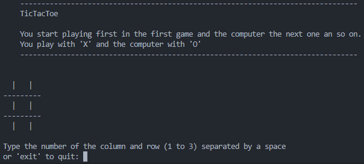

# Minimax algorithm for TicTacToe

This is a simple and well documented implementation of the minimax algorithm for the TicTacToe game in Python. The game allows a player to play against a computer opponent using this basic AI algorithm.

## How to Play

1. Run the game:

    ```bash
    python main.py
    ```



2. Follow the on-screen instructions to make your moves. To make a move, enter the column and row numbers separated by a space when prompted. For example, entering `2 3` would place your 'X' in the second column and third row. Or if you want to quit the game enter `exit`.

## The minimax algorithm

The minimax algorithm uses a simpley evaluation function to choose the move that maximizes the potential score for the computer and minimizes the potential score for the human player. By assigning a value of 100 for a computer win and -100 for a human player win, the minimax algorithm ensures that it explores all possibilities to maximize the computer's chances of winning and minimize the human player's chances. 

The simplicity of this evaluation is crucial for the efficiency of the minimax algorithm. With only two possible outcomes (win or lose), the algorithm can efficiently explore the entire game tree and make optimal decisions at each level. This guarantees that the computer will either win or force a draw, making it a reliable strategy to avoid losing the game.